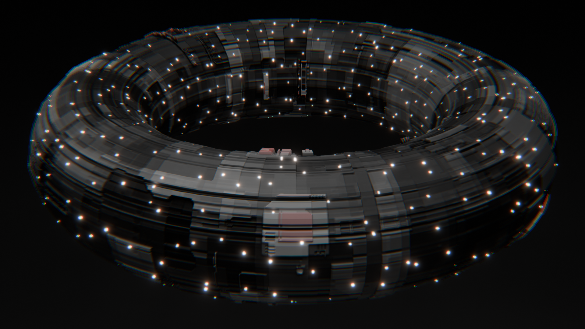

# Synth Surface

Maintained by [@nopeburger](https://github.com/nopeburger).

Synth Surface 1.1 is a Blender add-on for procedural science-fiction surface textures. It builds a grayscale height map, derives color and normal maps, and can add scattered emission lights. **Generate & Apply** creates a material and a non-destructive displacement modifier stack on the selected mesh.

This repository is a Blender port and derivative of [Displacement X](https://github.com/satelllte/displacementx), the web-based generator by satelllte and contributors. It retains that project's Git history for fork provenance. The current tree contains the Blender add-on rather than the upstream web app. See [NOTICE.md](NOTICE.md) and [LICENSE](LICENSE).

## Surface examples

These Blender renders use different seeds, contrasting color bands, displacement strengths, and view distances. Each uses a 2048-pixel map and Simple subdivision level 10 on a flat plane with four starting quads, providing about four million surface faces for narrow features. The camera stays within the plane so its outer edge does not distract from the surface. Sharp Color Edges gives each height range a distinct color.

**Copper, medium view:** 580 iterations, Seed 84, displacement strength 0.07, Classic and Circuitry sprites. Orange copper, oxidized teal, and charcoal bands share the surface.

**Violet, close view:** 340 iterations, Seed 143, displacement strength 0.045, Classic and Circuitry sprites. Pink, cyan, indigo, and violet bands mark different heights.

**Steel, medium view:** 460 iterations, Seed 51, displacement strength 0.065, Circuitry sprites. Teal, blue, bronze, and green bands pick out different heights without bright white peaks.

The same steel surface seen closer:

The grayscale height map behind the steel renders:

### Scatter lights

Scatter Lights can add colored emission in round or square shapes:

The same feature on a torus, with small glowing lights across the displaced surface:

## Requirements

- Blender 3.0 or newer, with Blender 5.1 also supported by the current preview and image update code.
- A mesh object; a usable UV map is recommended for predictable texture placement.
- No network connection or separately installed Python packages are needed inside Blender. The sprite cache is bundled.

## Install

1. Download the release archive named `synth_surface_v1.1.zip`. If building from this repository, run `python scripts/build_release.py` and use `dist/synth_surface_v1.1.zip`. **Do not use GitHub's “Download ZIP” repository archive** as the install archive; it contains contributor files and has a different directory layout.
2. In Blender, open **Edit > Preferences > Add-ons**. Choose the drop-down at the upper right, then **Install from Disk** (or **Install…** on older Blender versions).
3. Select the release ZIP without extracting it. Search for **Synth Surface** in Add-ons and enable **Synth Surface - Procedural Greeble Textures**.
4. Open a 3D Viewport, press **N** to show its sidebar, and select the **Synth Surface** tab.

To update, install the newer release ZIP through the same Add-ons menu, then restart Blender if the previous version remains loaded. The add-on's package identifier is `displacementx_addon`, retained for compatibility with existing Blender projects.

## First surface

1. Select a mesh. Add or unwrap a UV map if you want control over texture placement. With no active UV map, the add-on falls back to Local mapping.
2. In the **Synth Surface** tab, leave the default generators enabled and click **Update Preview**. The preview is a quick, reduced-size view; **Open Large** opens it in an Image Editor window.
3. Change **Seed** to explore arrangements. Adjust **Iterations** to change density. The Rect, Grid, Cols, Rows, Lines, and Sprites sections control the kinds of marks used.
4. In **Output**, set **Aspect Ratio** and **Long Edge** (or Custom width and height). Start small, such as 1024 or 2048 pixels, to check memory and generation time. Set **Displacement Strength** to suit the object's scale.
5. Leave **Auto Subdivision** and **Weld Coincident Vertices** on for a typical low-poly mesh. Click **Generate & Apply to Selected Object**.
6. Inspect the material and the **Synth Surface Weld**, **Synth Surface Subdivision**, and **Synth Surface Displace** modifiers. Save the `.blend` file; generated images are packed into it.

Optional **Scatter Lights** adds an emission image and material connection. **Light Seed** changes light placement independently of the surface Seed. For visible glow in a render, add a compositor Glare node; the add-on does not change the compositor.

## What the controls do

The [full user guide](docs/USER_GUIDE.md) explains every generator, sprite pack, composition mode, color stop, canvas mask, output setting, scatter-light control, and common troubleshooting case. Some quick distinctions:

- **Update Preview** changes only the sidebar preview. **Generate & Apply** updates the selected mesh.
- **Randomize All** changes generator choices and the surface seed, but leaves output dimensions, color stops, displacement settings, and scatter-light settings alone.
- **Seamless** wraps pattern features across image edges. A shaped canvas mask still has a visible boundary.
- **Canvas Shape** masks the generated maps; it does not cut mesh geometry.
- Higher output resolution increases memory use and may require denser mesh subdivision for physical displacement.

## Repository layout

- `displacementx_addon/`: installable Blender package and bundled sprite cache.
- `displacementx_addon/sprites/*/*.svg`: original sprite artwork kept for revisions and cache rebuilding. The release ZIP includes only the prebuilt runtime cache.
- `docs/USER_GUIDE.md`: detailed installation and usage reference.
- `docs/images/`: rendered examples and a generated height map; PNG metadata is stripped before publishing.
- `scripts/build_release.py`: builds a minimal install ZIP from an explicit file list.
- `scripts/build_sprite_cache.py`: rebuilds the cache when sprite artwork changes.
- `tests/`: Blender integration checks for the source and the release archive.

See [CONTRIBUTING.md](CONTRIBUTING.md) to work on the add-on and rebuild a release.
