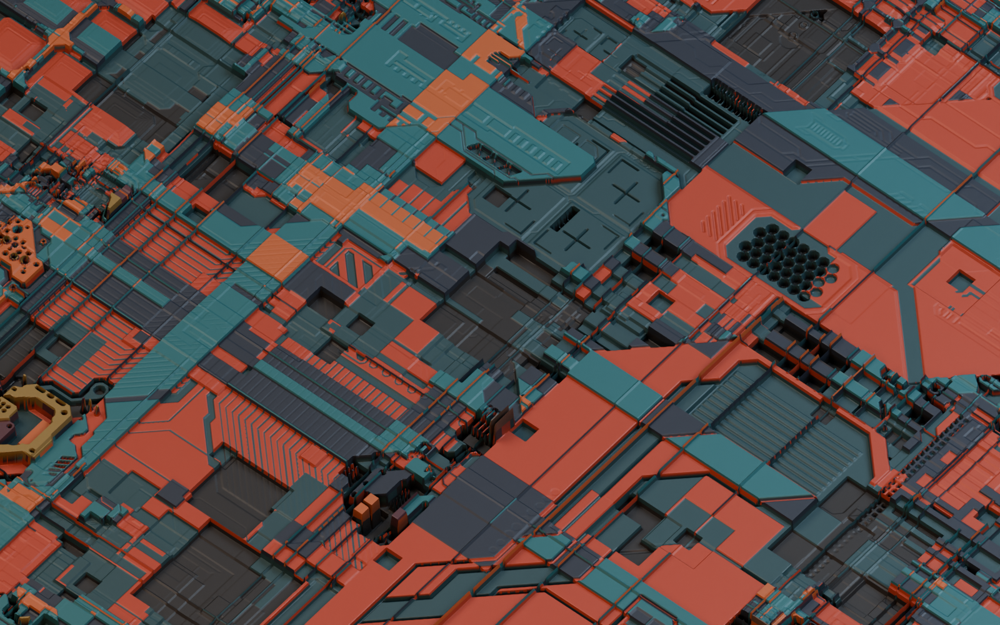
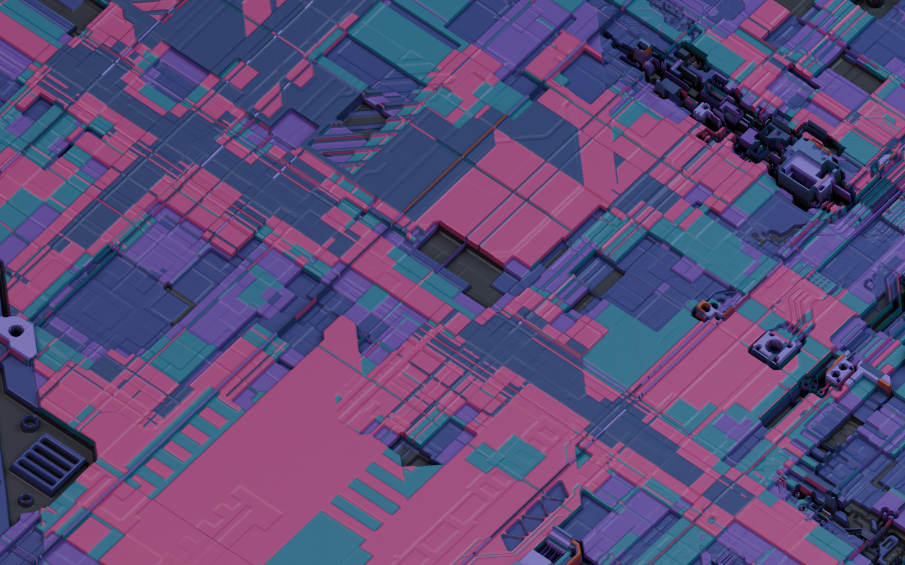
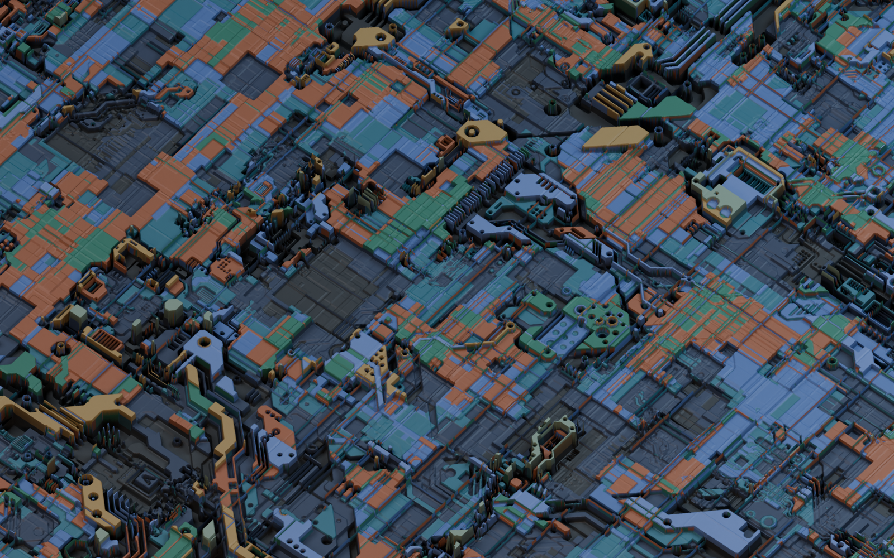
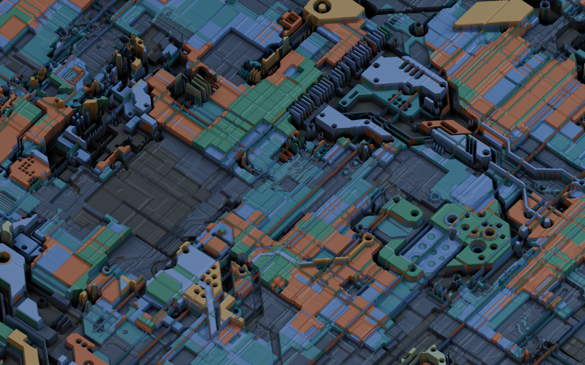
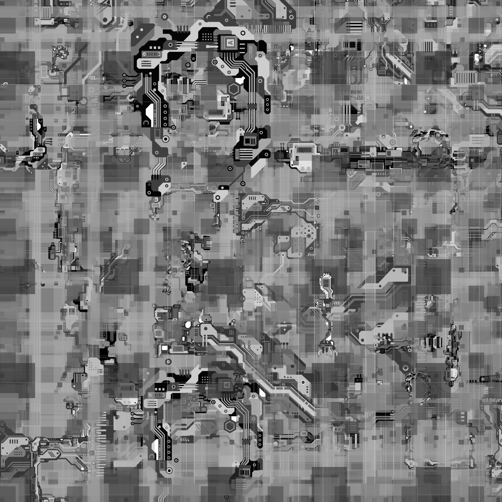
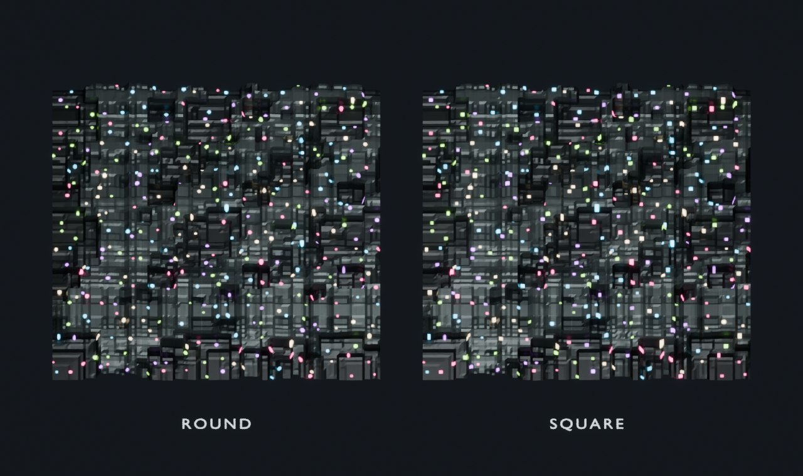

# Synth Surface Blender Add-on — User Guide

**Author / Maintainer:** Nopeburger

This guide covers Synth Surface for Blender v1.1. The add-on procedurally builds a grayscale height map, converts that height map into color and normal maps, and applies the result to the selected mesh. Synth Surface is based on the original Displacement X project.

## Install and open

1. Get the **release archive** `synth_surface_v1.1.zip`. Contributors can create it with `python scripts/build_release.py` from the repository root. The repository's automatic **Download ZIP** is not the install archive.
2. In Blender, choose **Edit > Preferences > Add-ons**, open the add-on menu at the upper right, and select **Install from Disk**. Older Blender versions may label this **Install…**. Select the release archive without extracting it.
3. Search for **Synth Surface - Procedural Greeble Textures** and enable its checkbox. If an older build remains active after updating, restart Blender.
4. Open a **3D Viewport**, press **N** to display the sidebar, and open the **Synth Surface** tab. The panel settings belong to the current scene.

Blender 3.0 or newer is declared by the add-on. Blender 5.1 is supported by its current image and preview code. A selected mesh is needed to apply the result. A UV map is recommended; with no active UV map, the add-on uses Local mapping. Generation needs no network connection or additional Python packages in Blender.

## Recommended workflow

1. Select a mesh with a usable UV map.
2. Adjust the generators and click **Update Preview**.
3. Change the **Seed** to explore different arrangements without changing the overall style.
4. Choose an **Aspect Ratio**, set the final **Long Edge** (or custom width and height), and adjust **Displacement Strength**.
5. Leave **Auto Subdivision** and **Weld Coincident Vertices** enabled for most objects.
6. Click **Generate & Apply to Selected Object**.

The add-on creates or updates these packed Blender images:

- **Synth Surface Color** supplies the material’s Base Color.
- **Synth Surface Normal** supplies tangent-space surface detail through a Normal Map node.
- **Synth Surface Height** drives the physical Displace modifier.
- **Synth Surface Lights** supplies emission when Scatter Lights is enabled.

It also creates the **Synth Surface** material and a modifier stack containing **Synth Surface Weld**, **Synth Surface Subdivision**, and **Synth Surface Displace** as needed.

### Example output

These examples show how seed, contrasting color bands, generator density, displacement strength, and camera distance change the result. All use a 2048-pixel map on a flat plane divided into four starting quads with **Subdivision Level 10**. This provides about four million surface faces to show narrow features. The camera frames the surface inside the plane boundary. **Sharp Color Edges** assigns a distinct palette color to each height range. A mesh with many starting faces can become much denser at that level; begin with Auto Subdivision and increase only as needed.

| Render | Seed | Iterations | Sprite packs | Strength | Color bands | View |
|---|---:|---:|---|---:|---|---|
| Copper | 84 | 580 | Classic, Circuitry | 0.07 | Orange, teal, charcoal | Medium |
| Violet | 143 | 340 | Classic, Circuitry | 0.045 | Pink, cyan, indigo, violet | Close |
| Steel | 51 | 460 | Circuitry | 0.065 | Teal, blue, bronze, green | Medium and close |

**Copper, medium view:**

**Violet, close view:**

**Steel, medium view:**

The steel close view uses the same map and subdivision level. Its teal, blue, bronze, and green bands separate heights while the rougher material keeps high areas from turning into bright spots:

The steel grayscale height map drives the **Synth Surface Displace** modifier. Lighter map regions are displaced outward relative to darker regions:

## Main actions

| Control | What it does |
|---|---|
| **Randomize All** | Randomizes the generator ranges, enabled generators, sprite packs, composition modes, background, iterations, and seed. It does not change color stops, Sharp Color Edges, output dimensions, canvas mask, seamless mode, displacement strength, subdivision, welding, or mapping. |
| **Update Preview** | Generates an aspect-correct color preview in the sidebar, fitted within 256 px on its longest edge. It does not modify the selected object. |
| **Open Large** | Opens the current preview in a separate Blender Image Editor window. |
| **Generate & Apply to Selected Object** | Generates the final color, normal, and height maps at the selected dimensions, builds the material, and refreshes the add-on’s modifiers on the active mesh. |

The preview accurately shows the aspect ratio, canvas mask, seed, colors, enabled generators, alpha, and composition modes. Geometric scale, gap, and line-width values are measured in texture pixels, however, so they occupy a larger percentage of the reduced preview than they do in a large final map. Sprite sizes scale proportionally with the shorter output edge.

## Basics

### Iterations

Controls the number of random drawing attempts used to build the height map. Higher values generally create denser, more layered detail and take longer to generate.

Each iteration randomly selects one of six generator slots: Rect, Grid, Cols, Rows, Lines, or Sprites. If the selected generator is disabled, that iteration is intentionally a no-op, matching the original Displacement X renderer. As a result, disabling generators makes the result sparser unless Iterations is increased.

Practical ranges:

- **100–500:** sparse, graphic patterns and quick tests.
- **500–1500:** balanced panel detail.
- **1500–4000:** dense, heavily layered greebles.
- **4000–10000:** very dense results with longer generation times and more blending buildup.

### Background

Sets the grayscale value placed across the map before any generators draw. The range is 0–255.

| Value | Height-map meaning | Typical displacement result |
|---:|---|---|
| **0** | Black | Maximum inward displacement relative to the modifier midpoint |
| **128** | Mid-grey | Approximately neutral; little or no base displacement |
| **255** | White | Maximum outward displacement relative to the modifier midpoint |

The background also passes through the color-stop gradient, so it determines the base material color in areas with no generated detail. A value near 128 is usually the safest starting point.

### Seamless

Wraps generated stamps across the left/right and top/bottom edges of the texture. The material and displacement textures are also set to Repeat when this is enabled. Use it for tiling textures or UV islands that need continuous edges.

Seamless texture edges do not automatically repair unrelated UV seams or disconnected geometry. Keep **Weld Coincident Vertices** enabled and use a clean UV layout.

### Seed

Controls the random arrangement. The same seed with the same settings produces the same height map. Change only the seed when you want a new layout while keeping the same visual style.

## Generator controls

Every enabled generator can be selected by an iteration. Values are randomly chosen between the corresponding Min and Max settings each time that generator runs. Min and Max may be entered in either order; the renderer sorts them internally.

### Shared generator settings

| Setting | Meaning |
|---|---|
| **Enabled** | Allows that generator to be selected. A disabled generator still retains its one-in-six iteration slot as a no-op. |
| **Brightness Min/Max** | Random grayscale value for generated shapes. `0` is black, `128` is neutral height, and `255` is white. The final result also depends on the active composition mode and existing pixels underneath. |
| **Alpha Min/Max** | Random opacity from `0` to `100` percent. Low alpha produces subtle blending; high alpha makes shapes approach their selected brightness more quickly. |
| **Scale Min/Max** | Approximate shape size in texture pixels. Because these are pixel values, a scale of 100 looks proportionally larger in a 256 px preview than in a 2048 px final map. |
| **Amount Min/Max** | Number of repeated items produced during one Cols or Rows generator event. |
| **Gap Min/Max** | Pixel spacing between repeated items. Larger gaps make patterns more sparse. |

### Rect

Draws individual rectangular panels at random positions.

| Setting | Effect |
|---|---|
| **Rect Enabled** | Enables rectangular panel stamps. |
| **Rect Brightness Min/Max** | Controls the height/color value of each rectangle. Wider ranges produce more varied panel depths. |
| **Rect Alpha Min/Max** | Controls how strongly each rectangle blends over existing detail. |
| **Rect Scale Min/Max** | Controls approximate rectangle width and height. Each dimension receives additional random variation, so rectangles are not always square. |

Rect is useful for broad panel breaks and large stepped surfaces.

### Grid

Draws a repeated field of square cells using a randomized cell size and gap.

| Setting | Effect |
|---|---|
| **Grid Enabled** | Enables repeated square-cell patterns. |
| **Grid Brightness Min/Max** | Controls the grayscale value of the cells. |
| **Grid Alpha Min/Max** | Controls the opacity of the entire generated cell field. |
| **Grid Scale Min/Max** | Controls approximate cell size in pixels. |
| **Grid Amount Min/Max** | Present in the v1.0 panel, but the current renderer fills the available canvas and does not yet use this range to limit the grid dimensions. |
| **Grid Gap Min/Max** | Controls pixel spacing between cells. Large values can reduce a grid event to only a few cells. |

### Cols

Draws groups of vertical strips extending through the texture height.

| Setting | Effect |
|---|---|
| **Cols Enabled** | Enables vertical strip groups. |
| **Cols Brightness Min/Max** | Controls strip height/color values. |
| **Cols Alpha Min/Max** | Controls how strongly strips blend over earlier detail. |
| **Cols Scale Min/Max** | Controls strip width in pixels, constrained by the available space. |
| **Cols Amount Min/Max** | Controls the number of strips attempted in one group. |
| **Cols Gap Min/Max** | Controls horizontal spacing between strips. If the combined gaps exceed the texture width, fewer strips may fit. |

### Rows

Draws groups of horizontal strips extending through the texture width.

| Setting | Effect |
|---|---|
| **Rows Enabled** | Enables horizontal strip groups. |
| **Rows Brightness Min/Max** | Controls strip height/color values. |
| **Rows Alpha Min/Max** | Controls how strongly strips blend over earlier detail. |
| **Rows Scale Min/Max** | Controls strip height in pixels, constrained by the available space. |
| **Rows Amount Min/Max** | Controls the number of strips attempted in one group. |
| **Rows Gap Min/Max** | Controls vertical spacing between strips. If the combined gaps exceed the texture height, fewer strips may fit. |

### Lines

Draws full-width horizontal or full-height vertical bands.

| Setting | Effect |
|---|---|
| **Lines Enabled** | Enables horizontal and vertical line bands. |
| **Lines Brightness Min/Max** | Controls line height/color values. |
| **Lines Alpha Min/Max** | Controls line opacity and how strongly bands affect existing pixels. |
| **Lines Width Min/Max** | Controls line thickness in texture pixels. |

Lines are useful for panel seams, broad divisions, and long technological tracks.

## Sprites

Sprites stamp the bundled SVG-based greeble designs into the generated height map. Sprite size is chosen randomly between approximately 1/32 and 1/2 of the shorter output edge. This keeps stamps square on rectangular canvases so circles do not stretch into ellipses.

| Setting | Effect |
|---|---|
| **Sprites** | Enables the sprite generator slot. |
| **Classic** | Enables 17 general-purpose Displacement X sprites. |
| **Big Data** | Enables 5 larger, dense technological designs. |
| **Aggromaxx** | Enables 12 complex mechanical/panel designs. |
| **Crap Pack** | Enables 27 smaller miscellaneous greeble designs. |
| **Circuitry** | Enables 10 asymmetrical circuit-board and signal-routing designs created for Synth Surface. |
| **Rotate Sprites** | Randomly rotates each stamp by 0°, 90°, 180°, or 270°. Disable it when the design should retain a consistent orientation. |

At least one pack must be enabled for sprites to appear. Enabled packs are combined into one random selection pool, so a larger pack is statistically chosen more often than a smaller pack. The SVGs are pre-rasterized into 1024×1024 cache cells and smoothly resampled when stamped. Rectangular SVG artwork is fitted proportionally inside the square cell, preserving circles and the source aspect ratio.

## Scatter lights

The same layout can use round or square scattered emission, independently of the surface Seed:

Enable **Scatter Lights** directly below Basics. Change the settings, then click
**Update Preview** or **Generate & Apply to Selected Object**.

| Control | Effect |
|---|---|
| Light Shape | Round discs or axis-aligned square lights. |
| Light Scale (%) | Diameter / square width as a percentage of the shorter texture edge. Default 0.4% is about 8 px at 2048. |
| Density | Total lights across the full canvas (0–50,000), before canvas masking. Independent of resolution, shape, and scale. |
| Intensity | Emission strength (default 5); zero disables emission when applied. |
| Color Mode | Single Color, or Random Palette with an editable list of colors. Each light picks one palette color with equal probability. |
| Position Randomness | 0 aligns lights on a grid; 1 jitters each light anywhere within its grid cell. |
| Size Variation | Randomly shrinks lights from the chosen scale; 0 gives equal size and 0.5 gives 50–100% of the chosen size. |
| Intensity Variation | Randomly dims lights; 0 gives equal strength and 0.4 gives 60–100% of the chosen intensity. |
| Light Seed | Changes light placement, sizes, brightness, and palette choices independently of the surface Seed. |

The default palette contains pink, cyan, green, warm white, and violet. **Add Color**
adds a swatch; edit any swatch with its color picker, remove it with X, or use
**Reset** to restore the default palette. At least one color remains in the list.
Increase a color's probability by adding it more than once. Black entries produce
unlit spots. Changing colors, size, shape, or intensity keeps light positions fixed.

Lights generate the packed **Synth Surface Lights** image and feed the material's
Emission Color and Emission Strength. The image stores linear RGB; its Non-Color
setting deliberately avoids a second color conversion. The HDR strength stays in
the shader. Height, normal, and base color maps stay unchanged. Turning Scatter
Lights off and applying removes the emission connection; it retains the previous
packed light image for reuse. Existing projects default to Scatter Lights off.

Lights follow the material's texture coordinates. Seamless wraps lights across
image edges; canvas masks clip all light emission outside the mask. Round lights
stay round in rectangular textures, though stretched UVs can stretch their shapes.
The light layout and proportional sizes stay consistent between preview and
final output; tiny lights may be faint in the 256 px preview. The preview adds an
SDR representation of emission and does not simulate lighting or compositor glow.

For soft halos, use a compositor **Glare** node set to **Fog Glow**
([Blender manual](https://docs.blender.org/manual/en/4.4/compositing/types/filter/glare.html)).
The add-on does not alter an existing compositor. A starting point similar to the
reference is Random Palette, Scale 0.2–0.5%, Density 800–2500, Intensity 5–15,
Position Randomness 1, Size Variation 0.5, and Intensity Variation 0.4.

**Randomize All** keeps scatter-light settings and the Light Seed unchanged.
Use Light Seed to explore light arrangements independently of the surface.

## Color stops

Color stops convert the completed grayscale height map into the material’s color texture. They do not change the physical height or normal maps.

Color-picker channels are limited to 0–1 because Synth Surface generates standard 8-bit color maps rather than HDR images. Version 1.0 also repairs out-of-range stop values saved by earlier unbounded picker properties. If an older scene still displays an unexpected stop, click **Reset** to restore black, grey, white, and red.

Each stop has:

- **Position:** Where it sits along the height range. `0.0` corresponds to black/height 0 and `1.0` corresponds to white/height 255.
- **Color:** The material color assigned at that height.
- **X:** Deletes that stop.

The default gradient is:

| Position | Color |
|---:|---|
| `0.000` | Black |
| `0.333` | Grey |
| `0.667` | White |
| `1.000` | Red |

Colors are smoothly interpolated between stops unless **Sharp Color Edges** is enabled. Stop rows do not need to be manually ordered; the renderer sorts them by position during generation.

| Control | Effect |
|---|---|
| **Add Color Stop** | Adds a new stop at a random position with a random color. |
| **Reset** | Deletes the current stops and restores black, grey, white, and red. |
| **Sharp Color Edges** | Uses hard color bands and nearest sampling for the color texture. This reduces soft color transitions stretched across steep displacement walls without changing height or normal-map filtering. |

## Composition modes

Composition determines how each new shape combines with the pixels already drawn. If several modes are enabled, one mode is selected randomly for each successful generator event. Modes are not all applied to the same shape in sequence.

If every mode is disabled, the renderer falls back to Source Over. Fresh scenes enable only Source Over by default.

| Mode | Effect on the grayscale height map |
|---|---|
| **Color Burn** | Aggressively darkens the existing result using the incoming shape; often creates deep recesses and near-black regions. |
| **Color Dodge** | Aggressively brightens the existing result; repeated layers can quickly approach white. |
| **Darken** | Keeps whichever value is darker. Useful for adding recessed detail without raising lighter areas. |
| **Difference** | Uses the absolute difference between existing and incoming values. Produces inversions and high-contrast technical patterns. |
| **Exclusion** | A softer, lower-contrast version of Difference. |
| **Hard Light** | Multiplies or screens depending on the incoming shape’s brightness. Produces strong contrast. |
| **Lighten** | Keeps whichever value is lighter. Useful for raised detail without deepening darker areas. |
| **Lighter** | Additively combines values. Repeated layers can saturate to white quickly. |
| **Luminosity** | Replaces luminosity with that of the incoming shape. Because the generator is grayscale, this usually resembles Source Over. |
| **Multiply** | Multiplies values and always darkens or preserves the existing result. Good for recesses and engraved detail. |
| **Overlay** | Multiplies dark backdrop values and screens light backdrop values, increasing contrast around mid-grey. |
| **Screen** | Brightens by combining the inverse values. Good for raised highlights. |
| **Soft Light** | A gentler contrast adjustment than Overlay or Hard Light. |
| **Source Atop** | Draws the incoming shape only where destination content already exists. With the initial opaque background it usually resembles Source Over, but it differs after XOR creates transparency. |
| **Source Over** | Normal alpha layering. The incoming shape blends over the current map according to its alpha. This is the most predictable default. |
| **XOR** | Keeps non-overlapping source or destination content and removes overlap. It can create cutouts and dark/transparent-looking regions. |

For controlled displacement, start with Source Over alone. Add Darken or Multiply for recesses, Lighten or Screen for raised detail, and Overlay or Soft Light for more contrast. Difference, Color Burn, Color Dodge, Lighter, and XOR produce more extreme results.

## Output settings

### Aspect Ratio and dimensions

**Aspect Ratio** controls the proportions of all three generated maps. Presets use **Long Edge** as the pixel size of the larger dimension. **Custom** exposes independent width and height fields. Every dimension can range from 64 to 8192 px.

| Aspect Ratio | Output with Long Edge 2048 |
|---|---:|
| **Square (1:1)** | 2048 × 2048 |
| **Landscape (2:1)** | 2048 × 1024 |
| **Landscape (4:1)** | 2048 × 512 |
| **Widescreen (16:9)** | 2048 × 1152 |
| **Portrait (1:2)** | 1024 × 2048 |
| **Portrait (9:16)** | 1152 × 2048 |
| **Custom** | User-defined width × height |

The panel displays the resolved dimensions and megapixel count before generation. Outputs above 32 megapixels show a high-memory warning. Higher pixel counts preserve smaller detail but increase generation time, Blender memory use, packed `.blend` size, and the mesh density needed for physical displacement. For example, 4096 × 4096 is about 16.8 MP, while 8192 × 8192 is about 67.1 MP.

### Canvas Shape

Canvas Shape limits the generated result to a geometric mask without changing the rectangular image dimensions.

| Shape | Behavior |
|---|---|
| **Full Rectangle** | Uses every image pixel. This is the default and preserves the output of earlier Synth Surface versions. |
| **Rounded Rectangle** | Clips the corners. **Corner Radius** ranges from square corners at 0 to strongly rounded corners at 0.5 of the shorter edge. |
| **Circle** | Creates a centered true circle based on the shorter edge. Extra canvas space remains outside the mask. |
| **Hexagon** | Creates a centered regular hexagon fitted inside the output dimensions. |

Non-full masks do not tile seamlessly at their masked boundaries. The panel displays a reminder if **Seamless** is also enabled.

### Outside Mask

This appears for Rounded Rectangle, Circle, and Hexagon.

| Mode | Color map | Height and normal maps |
|---|---|---|
| **Background** | Uses the gradient color corresponding to **Background**. | Uses the Background height. |
| **Neutral Height** | Uses the gradient color at mid-grey. | Uses height 128, keeping physical displacement approximately flat. |
| **Transparent Color** | Writes alpha 0 outside the mask and connects color alpha to the material. | Uses neutral height 128 outside the mask. |

Transparent Color hides the outside region in the Synth Surface material; it does not cut or delete mesh geometry. Material transparency also depends on the active render engine and shadow settings. The generated height and normal images remain opaque because only the color map needs alpha.

### Invert

Reverses the generated height map after drawing: black becomes white and white becomes black. This swaps recesses and raised areas, reverses the normal-map direction, and changes which parts receive the high and low color-stop colors.

### Displacement Strength

Controls how far **Synth Surface Displace** moves vertices along their normals.

- `0` disables visible physical movement while retaining the modifier.
- Small positive values such as `0.01–0.05` create subtle panels.
- Larger positive values produce deeper extrusion.
- Negative values reverse the displacement direction.

The practical value depends on the object’s scale. Apply the object’s scale in Blender when displacement strength behaves inconsistently across axes.

### Auto Subdivision

Automatically selects a Simple subdivision level from the longer output dimension, targeting approximately one displaced sample for every eight texture pixels. This provides enough geometry to reduce stair-stepping without rounding hard-surface shapes.

The estimate is reduced when the original mesh is already dense so the generated result stays below approximately two million faces. Blender reports a warning when this safety cap lowers the requested automatic level.

### Recommended level

Displays the long-edge-based level before the selected mesh’s face-count safety cap is applied. The number in parentheses is the approximate number of segments produced along each original face edge.

### Subdivision Level

Appears when Auto Subdivision is disabled. It manually controls the Simple subdivision level from 0 to 10. Each level approximately quadruples the face count:

$$\text{generated faces} \approx \text{original faces} \times 4^{\text{level}}$$

Use manual levels carefully on an already-dense mesh. Too low causes blocky displacement terraces; too high can make Blender slow or consume excessive memory.

### Weld Coincident Vertices

Adds **Synth Surface Weld** before subdivision and displacement. It merges vertices that occupy the same position, helping prevent adjacent but disconnected faces from pulling apart and creating cracks.

Disable it only when coincident vertices are intentionally separate or the mesh has no seam-tearing problem.

### Displacement Mapping

Controls which coordinates the Blender Displace modifier uses to sample **Synth Surface Height**.

| Mode | Behavior |
|---|---|
| **UV** | Uses the active UV map. This is recommended because it gives predictable placement and supports deliberate seams and orientation. If the mesh has no active UV map, the add-on falls back to Local. |
| **Local** | Uses object-local coordinates. The texture follows the object when it moves and can be useful when no UV map exists, but placement depends on the object’s local bounds/orientation. |
| **Global** | Uses world coordinates. Moving the object through the scene changes which part of the texture it samples. Useful for aligning patterns across multiple objects. |

## Troubleshooting

### The displacement looks blocky or terraced

- Enable **Auto Subdivision** and click **Generate & Apply** again.
- Confirm that Blender created **Synth Surface Subdivision** before **Synth Surface Displace**.
- Increase the final Long Edge or custom dimensions if the height image itself is visibly pixelated.
- Ensure the object has an appropriate UV map when using UV mapping.

### The geometry tears open

- Enable **Weld Coincident Vertices**.
- Apply the object’s scale.
- Check for duplicated faces, non-manifold geometry, or UV seams combined with disconnected mesh vertices.

### The preview and final map differ in detail density

The preview preserves the final aspect ratio but is fitted within 256 px on its longest edge. Most geometric scale, gap, and width values are absolute pixels, so they occupy a larger fraction of this reduced preview than they do in a high-resolution final map. Judge exact density from a lower-resolution final test. Sprites scale with the shorter edge and are less affected.

### A circle looks stretched on the object

The generated image contains a true circle, but the object’s UV island may stretch the rectangular texture. Scale the UV island to match the selected output aspect ratio, or use a square output on square UV space. Applying non-uniform object scale can also distort displacement when Local mapping is used.

### The masked area is still present as geometry

Canvas masks control texture pixels, not mesh topology. **Transparent Color** hides the material outside the mask and **Neutral Height** keeps that area flat, but neither option removes faces. Use a separate geometry workflow if the mesh itself must be circular or hexagonal.

### No sprites appear

- Enable **Sprites**.
- Enable at least one sprite pack.
- Increase Iterations; the sprite generator receives only one of the six possible generator slots.
- Disable some geometric generators only if you also understand that their slots become no-ops rather than increasing sprite selection probability.

### Colors smear down steep displaced sides

Enable **Sharp Color Edges** and click **Generate & Apply** again. This switches the generated color map to hard stop bands and changes only the material's Base Color texture to nearest sampling. The height texture and normal map remain smoothly filtered. Some lighting gradients can still appear on vertical faces; those are surface shading rather than color-texture bleeding.

### The whole object moves inward or outward

Set **Background** near 128. The Displace modifier uses 0.5/mid-grey as its neutral midpoint.

### Results become almost entirely black or white

Reduce Iterations or alpha, narrow the brightness ranges, and use Source Over alone. Color Burn, Color Dodge, Lighter, Multiply, and Screen can accumulate rapidly.

### A second preview will not update

Update to the current release. It replaces the cached preview key and uses a new temporary image file for each refresh.

### Changing from 2048 to 4096 reports an incorrect pixel sequence size

Update to the current release. Blender 5.1 can temporarily retain the previous image's pixel-buffer length after `Image.scale()`, even though the displayed image dimensions have changed. Synth Surface replaces generated image data blocks when dimensions change and reuses them only when their dimensions and channel count already match.
